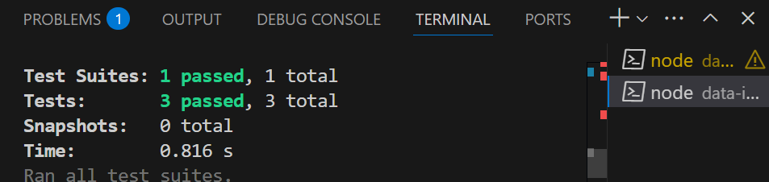

# Data Ingestion API System

**Author:** Jatin  
**Contact:** jatinsihag16@gmail.com

Hi! Thanks for checking out my Data Ingestion API project. This was a fun challenge where I built a system that can accept data ingestion requests, process them in batches, and let you check their status—all while respecting priorities and rate limits, just like a real-world backend service.

---

## Project Structure

```
data-ingestion-api
├── src
│   ├── app.js                  # Main entry point
│   ├── services
│   │   └── ingestionManager.js # Handles batching, queueing, and processing
│   └── tests
│       └── api.test.js         # Automated tests
├── package.json
└── README.md
```

---

## API Endpoints

### 1. Submit Ingestion Request

- **POST /ingest**
- **What it does:** Submit a new ingestion job with a list of IDs and a priority.
- **Sample Request:**
  ```json
  {
    "ids": [1, 2, 3, 4, 5],
    "priority": "HIGH"
  }
  ```
- **Sample Response:**
  ```json
  {
    "ingestion_id": "unique_id"
  }
  ```

### 2. Check Ingestion Status

- **GET /status/<ingestion_id>**
- **What it does:** Check the status of your ingestion job and see how each batch is doing.
- **Sample Response:**
  ```json
  {
    "ingestion_id": "unique_id",
    "status": "triggered",
    "batches": [
      { "batch_id": "uuid1", "ids": [1,2,3], "status": "completed" },
      { "batch_id": "uuid2", "ids": [4,5], "status": "triggered" }
    ]
  }
  ```

### 3. Health Check (Bonus!)

- **GET /health**
- **What it does:** Just returns `{ "status": "ok" }` so you know the server is up.

---

## How to Run This Project

1. **Clone the repo:**
   ```
   git clone <repository-url>
   ```
2. **Go to the project folder:**
   ```
   cd data-ingestion-api
   ```
3. **Install dependencies:**
   ```
   npm install
   ```
4. **Start the server:**
   ```
   npm start
   ```
5. **Run the tests:**
   ```
   npm test
   ```

---

## Why I Built It This Way (Design Decisions)

- **Batching:** Every 3 IDs go into a batch. This keeps processing efficient and matches the rate limit.
- **Priority Queue:** HIGH priority jobs always jump ahead of MEDIUM and LOW, but within the same priority, jobs are handled in the order they came in.
- **Async Processing:** Only one batch is processed every 5 seconds, simulating a real external API’s rate limit.
- **Status Tracking:** You can always see the status of your request and each batch—whether it’s waiting, running, or done.
- **In-Memory Storage:** For this demo, everything is stored in memory for speed and simplicity.
- **Testing:** I wrote automated tests to make sure everything works, including edge cases.

---

## Testing

- I used **Jest** and **Supertest** for testing.
- To run all tests:
  ```
  npm test
  ```
- Tests cover:
  - Submitting and checking ingestion requests
  - Error cases (bad input, unknown IDs)
  - Priority and batching logic

---


## What Was Tricky & What I Learned

- **Challenge:** Making sure higher-priority jobs always get processed first, but still handling jobs in the order they arrive within the same priority.
- **Solution:** I used array sorting and async/await to enforce both priority and FIFO order, and to make sure only one batch runs every 5 seconds.
- **Learned:** How to design a real-world API system with constraints, and how to write tests that actually catch bugs before they happen.

---

---

## Screenshots


*Above: All tests passing!*

---

## Personal Note

I really enjoyed this project—it was a great way to practice building APIs that mimic real-world constraints like batching, rate limiting, and priority handling. I focused on writing clean, well-documented code and making sure everything is tested.  
If you have any questions or feedback, feel free to reach out!

Thanks for reviewing my work!

---
